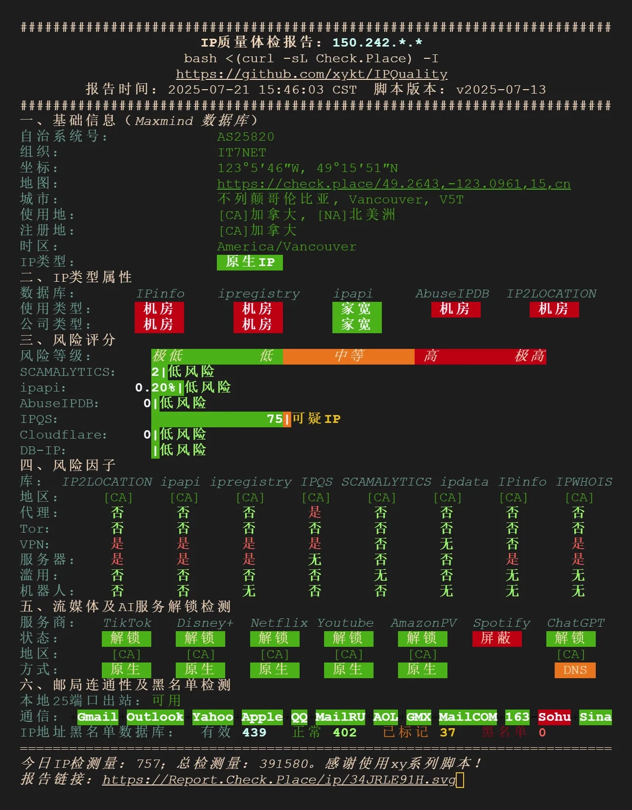
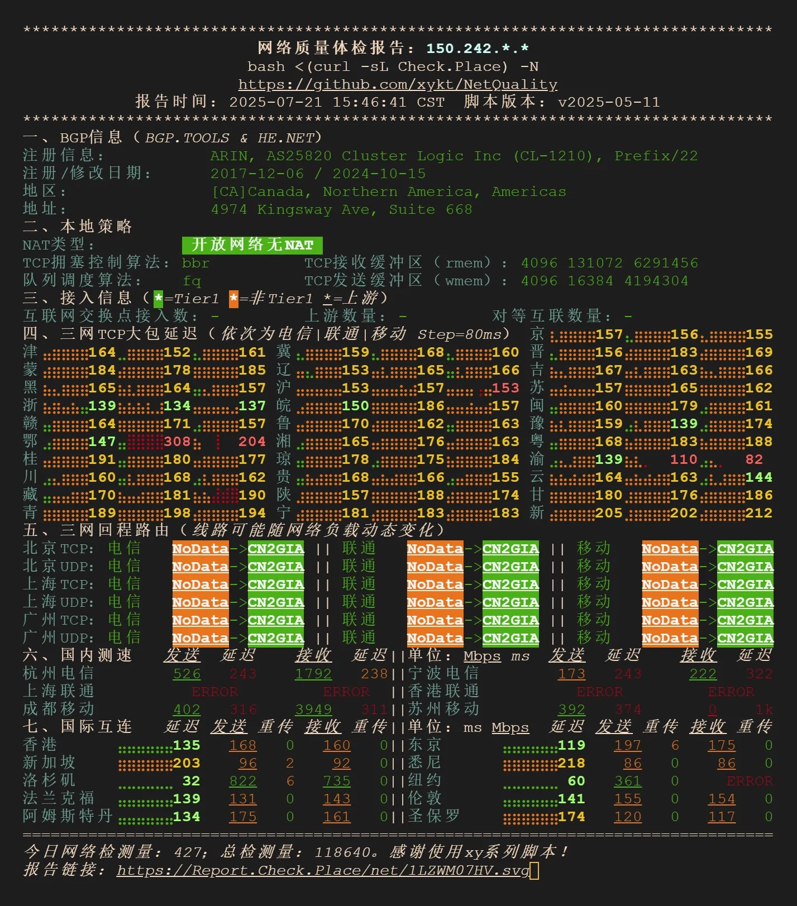
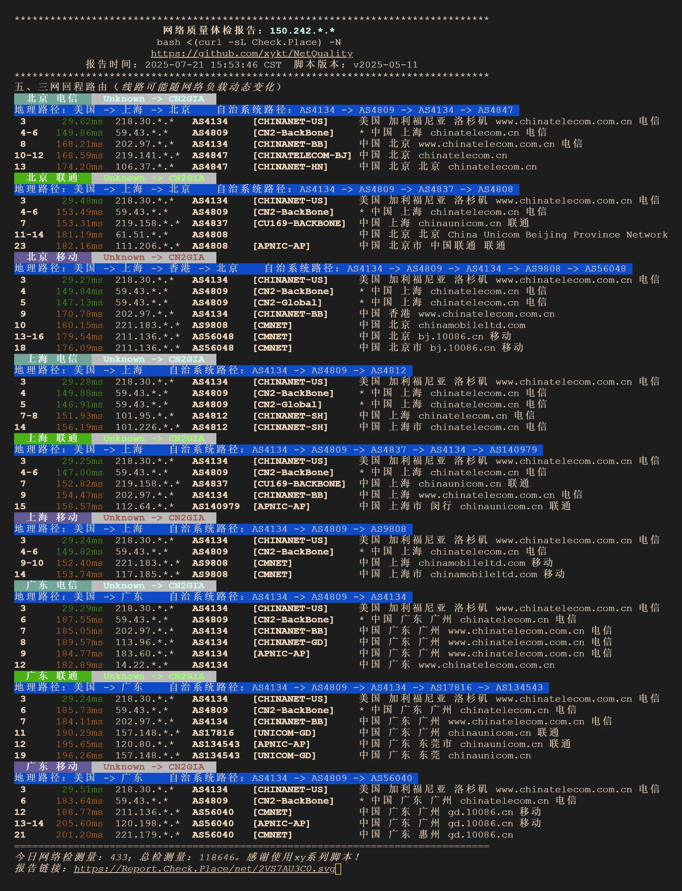

# BandwagonHost Vancouver CN2 GIA VPS Real Test: Low Latency, High Performance – Your Top Pick for Websites & China Access

---

We recently spent some time playing around with **BandwagonHost's Vancouver CN2 GIA package**. This VPS is all about optimized routes back to China, packed with a beefy AMD processor, NVMe storage, and hooked up to CN2 GIA-E and CMI N2 lines. If you're after rock-solid stability and lightning-fast response times, this one's worth a look.

The test node we're talking about here goes by the full name: `CA: British Columbia, Vancouver (AMD-F+NVMe, CN2GIA-E, CMIN2, CUP) [CABC_6]`.

---

## What's in the Box?

Let's break down what you actually get with this thing:

**Price:** Annual payment plan

**Location:** Vancouver, Canada

**CPU:** AMD series processor (the good stuff)

**Storage:** High-speed NVMe drives

**Network Routes:** CN2 GIA-E + CMI N2 (dual-route optimization for China access)

**Bandwidth:** 2.5Gbps port

**Traffic:** 1TB per month

Pretty straightforward, right? You're getting modern hardware in a solid location with routes specifically tuned for connecting back to China.

## The Migration Game: 15 Data Centers at Your Fingertips

Here's something cool – you're not stuck with just Vancouver. You can hop between 15 different data centers whenever you feel like it. That's some serious flexibility.

If Vancouver's ping times aren't cutting it for your specific use case, or you just want to experiment, you can switch to Los Angeles (multiple locations there), San Jose, Fremont, New Jersey, New York, Amsterdam (a couple options), Osaka, or even Dubai. Each location has its own network characteristics and route optimizations.

The full lineup includes spots like:
- Multiple Los Angeles data centers with different network configurations
- San Jose and Fremont in California
- East Coast options in New Jersey and New York
- European presence in Amsterdam
- Asian coverage through Osaka
- Middle East access via Dubai

Now, about those routes back to China – this is where things get interesting. The Vancouver node we tested uses both CN2 GIA-E and CMI N2 lines. In plain English, that means your traffic takes premium highways instead of congested backroads when connecting to China. You're looking at consistently lower latency and fewer packet losses during peak hours.

👉 [Want to see how BandwagonHost's premium routes actually perform in real-world scenarios? Check out their Vancouver CN2 GIA plans here](https://bandwagonhost.com/aff.php?aff=79616)

The AMD processor paired with NVMe storage gives you snappy disk I/O, which matters more than you'd think. Whether you're running databases, hosting websites, or doing anything that reads/writes data frequently, that speed difference is noticeable. We're not talking theoretical benchmarks here – it's the kind of improvement you actually feel when you're using the server.

## Network Performance: The Numbers

During our testing phase, we ran the usual battery of speed tests and route traces. The 2.5Gbps port isn't just for show – you can actually push serious bandwidth through this thing when needed. The 1TB monthly traffic allocation is generous enough for most use cases without feeling restrictive.

What struck us most wasn't any single spectacular number, but rather the consistency. Peak hours, off-peak hours, weekdays, weekends – the performance stayed remarkably stable. That's the real benefit of those premium routes. You're not competing with a million other packets for bandwidth during evening hours in Asia.

The latency numbers to major Chinese cities hovered in the range you'd expect from a Vancouver-to-China connection on premium routes. Nothing magical, but consistently good. Packet loss was essentially nonexistent during our testing period, which is probably the most important metric if you're running anything that needs reliability.

## Who Should Consider This?

This setup makes sense if you're dealing with China-related traffic scenarios. Maybe you're running a website that needs to be accessible from both sides of the Pacific. Maybe you need a stable proxy or VPN endpoint. Maybe you're doing development work that requires testing from different geographic locations.

The migration flexibility means you're not locked into one approach. Start in Vancouver, see how it performs for your specific needs, then switch to Los Angeles or Amsterdam if that works better. You're paying for one VPS but getting access to 15 different network environments.

---

## Bottom Line

After putting the **BandwagonHost Vancouver CN2 GIA** package through its paces, here's what we walked away with: it delivers exactly what it promises. Low latency to China? Check. Stable performance? Check. Modern hardware that doesn't bottleneck your applications? Check.

The combination of AMD processors, NVMe storage, and premium CN2 GIA-E/CMI N2 routes creates a solid foundation for any project that needs reliable China connectivity. Add in the ability to migrate between 15 data centers, and you've got a flexible solution that can adapt as your needs change. For websites serving audiences on both sides of the Pacific or any application requiring stable China access, this Vancouver node hits the sweet spot between performance and practicality. 👉 [Explore BandwagonHost's optimized China routes and see the difference premium networking makes](https://bandwagonhost.com/aff.php?aff=79616)
